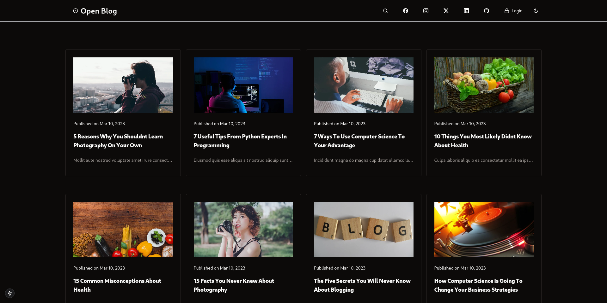
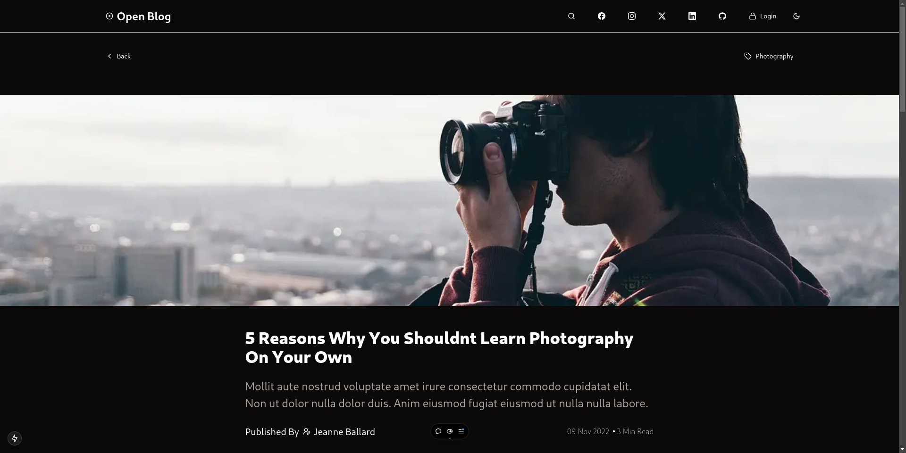
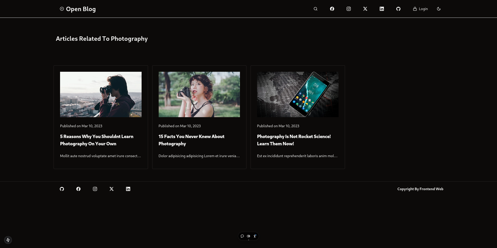
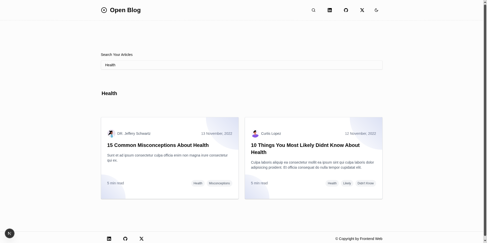
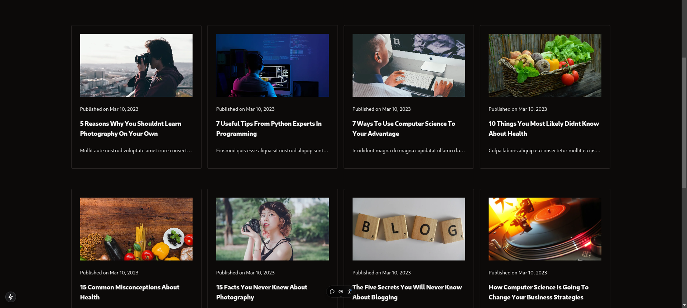

The Open Blog is a open source template is design and built with Next.js 15, Shadcn UI and tailwind CSS. 

Take a look at the demo of the Minimalist template!

## Demo

[](https://open-blog-beta.vercel.app/)

## Our Template Stack


## Pictures












## Clone Repository

First, download the Next.js open blog template code from the GitHub repository using the following command:

```bash
git clone git clone https://github.com/frontendweb3/open-blog.git
```
Then follow the below **steps**:

```markdown
# step 1
cd open-blog

# step 2
pnpm install
#  or 
yarn install

# step 3
yarn dev
#    or
pnpm dev
```


### Our primary stack for the Open Blog template includes:

1. Next.js
2. TypeScript
3. PNPM
4. Shadcn UI
5. Tailwind CSS

## Additional packages:

1. Lucide icons
2. @tailwindcss/typography
3. fuse.js

After downloading, open your browser and navigate to [http://localhost:3000](http://localhost:3000) to see the result.
