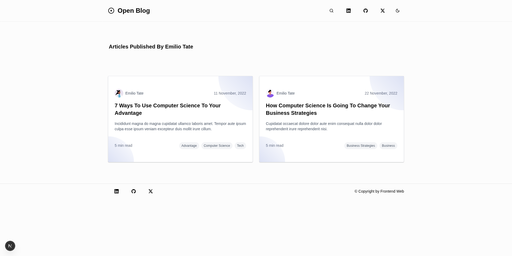

# Open Blog

The Open Blog is an open-source blogging template created with Next.js 15, TypeScript, a Rest API, Shadcn UI, and Tailwind CSS.

**Check out the demo of the Minimalist template.**

## Demo

[](https://open-blog-beta.vercel.app)

## Our Template Stack

- **Next.js**
- **Tailwind CSS**
- **TypeScript**
- **Rest API**
- **Shadcn UI**

## Pictures





## Clone Repository

First, clone the Next.js open blog repository from GitHub using the following command:

```bash
git clone git clone https://github.com/frontendweb3/open-blog.git
```

Then follow the below **steps**:

```markdown
# step 1

cd open-blog

---

# step 2

pnpm install

# or

yarn install

---

# step 3

yarn dev

# or

pnpm dev
```

### Our primary stack for the Open Blog template includes:

1. Next.js
2. TypeScript
3. PNPM
4. Shadcn UI
5. Tailwind CSS

## Additional packages:

1. `Lucide icons` - this library is used for svg icons
2. `@tailwindcss/typography` -This library is used for styling the article content
3. `fuse.js` - This library is used for building a search.

After downloading, open your browser and navigate to [http://localhost:3000](http://localhost:3000) to see the result.
